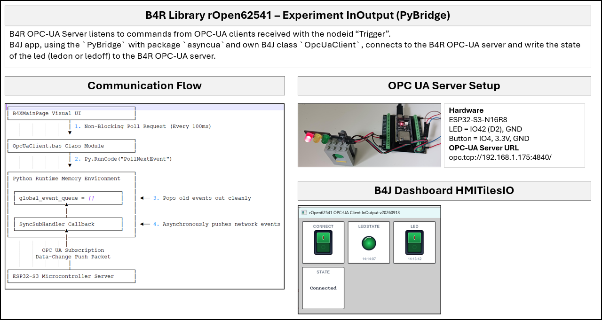

# rOpen62541

> [!WARNING]
> **Final Testing & Documentation In Progress**  
> Core server developments are complete and in final testing, meaning minor API changes may still occur before the formal release. Documentation and project examples are actively being written and updated.

**rOpen62541** is an open-source [B4R](https://www.b4x.com/b4r.html) library wrapper for the industrial open62541 OPC UA protocol stack, specifically optimized for the ESP32-S3 Dual-Core architecture. 
It provides thread-safe cross-core communication, dynamic string-node creation, and type-agnostic runtime write diagnostics.

---

## Project Overview & Background

<b>Author's Note & Personal Context (Click to expand)</b>

**This library was developed purely for personal educational use**, born out of a desire to dive deep into industrial connectivity and tackle the challenging feat of wrapping the open62541 stack for [B4R](https://www.b4x.com/b4r.html). 
It wasn't easy to build, but exploring cross-platform client integration — such as [B4J](https://www.b4x.com/b4j.html) with the PyBridge and [opcua-asyncio](https://github.com/FreeOpcUa/opcua-asyncio) or [Node-RED](https://nodered.org) — and seeing the dual-core hardware spring to life made it an incredibly rewarding project. 
Moving forward, this proof-of-concept server framework will serve as a foundational wireless gateway component for the author's open-source several **MAKE projects**.

<b>What is OPC UA & What is it used for? (Click to expand)</b>

**OPC UA (Open Platform Communications Unified Architecture)** is a robust, platform-independent, and highly secure industrial machine-to-machine (M2M) communication protocol framework widely deployed in **Industry 4.0 / Industrial IoT (IIoT)** environments.
Unlike standard message-based IoT protocols (like MQTT), OPC UA provides a unified Address Space allowing devices to structurally expose complex object folders, variable data nodes, and custom tracking methods with rich data metadata. It is extensively used to interconnect hardware sensors, embedded controllers, PLCs, industrial SCADA systems, and high-level enterprise MES/ERP software architectures seamlessly over modern Ethernet/Wi-Fi networks.

---

## Purpose & Scope

* **Server-Only Architecture:** This library is dedicated exclusively to acting as an OPC UA Server data provider; it does not include client connection parsing capabilities.
* **Proof of Concept & Learning Project:** This framework was explicitly developed as a personal educational project to learn the foundational basics of OPC UA by creating a custom standalone hardware device from scratch.
* **No Professional Intent:** There is absolutely no intention for this codebase to be deployed in mission-critical environments, production facilities, or professional commercial installations.

*Note: For a detailed breakdown of the underlying dual-core task design and memory synchronization layers, see the [Developer Notes](docs/DEVNOTES.md).*

---

## Compatibility & Verified Clients

### Hardware & Platform Compatibility
* **Supported Hardware:** Optimized for **Espressif ESP32-S3** high-memory microcontrollers (specifically the **N16R8** format featuring 16MB Flash and 8MB PSRAM).
* **Network Layer:** Requires standard embedded network `lwIP` socket frameworks to be initialized on boot.

### Verified OPC UA Clients
This server implementation complies strictly with core industrial data-modeling specs and has been successfully verified across multiple desktop, terminal, and automation client ecosystems:

* [**Node-RED**](https://nodered.org) — Fully interoperable using the standard `node-red-contrib-opcua` flow palette node module.
* [**opcua-commander**](https://github.com/node-opcua/opcua-commander) — Validated using the interactive, keyboard-driven terminal curses explorer (TUI).
* [**B4J (Native Client)**](https//www.b4x.com/android/forum/threads/opc-ua-industrial-client-library-connect-to-servers-devices.171977/) — Smooth integration with OPC UA Client library for B4J.
* [**B4J with PyBridge**](https://www.b4x.com/android/forum/threads/pybridge-the-very-basics.165654/#content) — Confirmed working via Python-backend socket communication routing bridges PyBridge framework.
* [**Node.js OPC UA Stack**](https://node-opcua.github.io) — Confirmed working via TypeScript client example.

---

## Install
Download the repository from [GitHub](https://github.com/rwbl/rOpen62541).
- Copy the src sub-folder **rOpen62541** into your B4R **Additional Libraries** folder, keeping the folder structure fully intact.
- Copy the src file **rOpen62541.xml** into your B4R **Additional Libraries** folder.

---

## Project Code Examples
The repository includes complete, ready-to-run environment folders tracking specific implementation patterns:

* [**Go to the Project Examples Index**](examples/) — Explore runnable source code frameworks for Environment Simulation, Method Callbacks, Peripheral I/O Mapping, and System Node ID lookups.

---

## Project Screenshot Example

---

## Guides & Documentation
For detailed tutorials, API blueprints, and environment configurations, please visit our centralized documentation hub:

* [**Go to the Project Documentation Hub**](docs/) — Complete step-by-step guides covering Callbacks, Node IDs, Developer Notes, Functions, and Troubleshooting.

---

## License

- **rOpen62541** Library * MIT License as stated in the LICENSE file provided with rOpen62541.
- **Open62541** Library * Mozilla Public License v2.0 as stated in the LICENSE file provided with open62541.

---

## Credits

- Developers, maintainers, and open-source contributors of the official [open62541 architecture framework](https://open62541.org), providing an industrial-grade embedded C implementation of OPC UA.
- Developer of the [open62541-121-esp32](https://github.com/cmbahadir/opcua-esp32) repository, which served as the foundation for this B4R wrapper.
- [Anywhere Software](https://www.b4x.com/) for the B4X suite of RAD development tools.
- Developer of the [B4J](https://b4x.com/b4j) library [SS_OPCUAClient](https://www.b4x.com/android/forum/threads/opc-ua-industrial-client-library-connect-to-servers-devices.171977/).
- AI for engineering collaboration.
---

**Disclaimer**

- All product names, logos, protocols, and brands are property of their respective owners.
- This B4R library is an independent open-source wrapper tracking standard open62541 architectures.
	- It is neither officially endorsed nor maintained by the primary open62541 project core maintainers.
- This codebase represents a strict standalone proof-of-concept / learning exercise and is explicitly **not intended for professional, commercial, or critical industrial application**.
- This wrapper, its cross-core FreeRTOS mutex mappings, and its data type interceptor routines were designed and polished with the specialized interactive assistance of an AI engineering collaborator, achieving optimal compatibility with the B4R pre-compiler stack.

---

